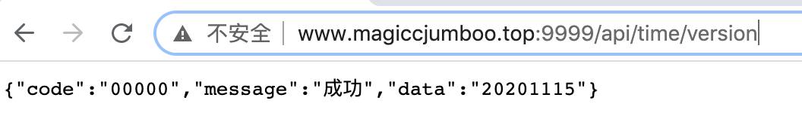
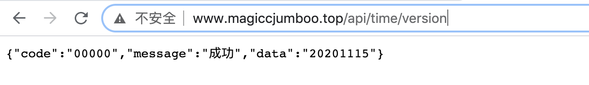
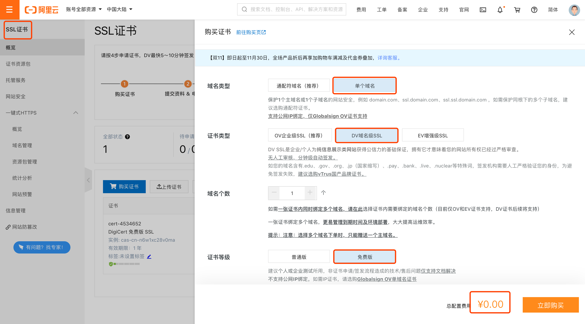
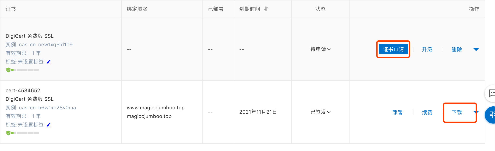
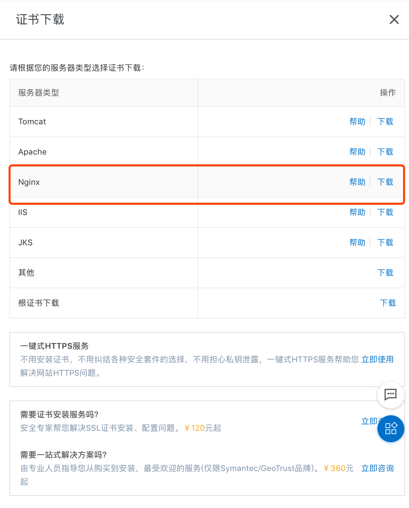
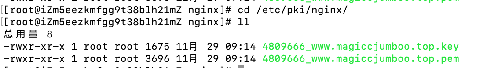
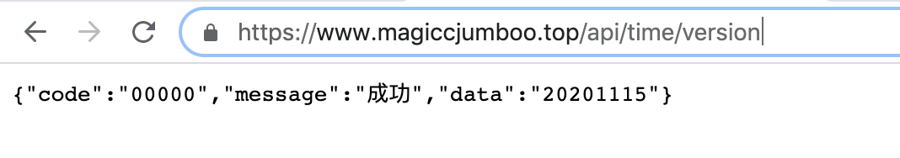

# 通过Nginx将Springboot程序暴露https接口

我们在使用springboot编写的后台接口，默认只有http协议可以访问，但是微信小程序只能访问https类型的接口，所以我们需要将http接口通过nginx转化成https接口。

## 一、编写springboot代码，暴露http接口

这里就正常的编写springboot代码，暴露localhost:9999/api/time/version接口，然后部署到Linux服务器中。

参考代码：https://github.com/shelimingming/time_manage/tree/main/time_manage_backend

**这里已经将www.magiccjumboo.top域名绑定了服务器。**如果想通过https暴露接口必须绑定域名。

访问：http://www.magiccjumboo.top:9999/api/time/version，即可得到结果



# 二、通过Nginx代理后端接口

下面我们需要通过Nginx代理这个接口：

### 1、安装Nginx

首先安装Nginx，详细过程这里就不赘述，可以参考这篇博客：https://www.cnblogs.com/zhangliuhero/p/13804731.html。

### 2、配置nginx.conf

vi /etc/nginx/nginx.conf:

```
server {
        listen       80 default_server;
        listen       [::]:80 default_server;
        server_name  _;
        root         /usr/share/nginx/html;

        location /api {
                proxy_set_header Host $host;
                proxy_set_header X-Forwarded-For $proxy_add_x_forwarded_for;
                proxy_pass http://127.0.0.1:9999/api;
        }
    }
```

配置/api路径都转发到本机的9999端口，就是我们刚刚发布的接口上，然后重新加载nginx，`nginx -s reload`。

### 3、验证

访问:http://www.magiccjumboo.top/api/time/version



但是访问https://www.magiccjumboo.top/api/time/version，还是访问不通，所以我们开始https的配置。

# 三、在阿里云上申请免费的 SSL证书

在阿里云中搜索SSL证书，点击购买证书，安装下图进行选择，可以免费申请SSL证书。



点击申请证书，填写域名相关信息，几分钟后自动审批完成，点击下载，可以下载Nginx的证书：





# 四、Nginx中SSL配置

将下载的两个文件拷贝到Nginx的机器中：



vi /etc/nginx/nginx.conf:

```
server {
        listen       443 ssl http2 default_server;
        listen       [::]:443 ssl http2 default_server;
        server_name  _;
        root         /usr/share/nginx/html;

        ssl_certificate "/etc/pki/nginx/4809666_www.magiccjumboo.top.pem";
        ssl_certificate_key "/etc/pki/nginx/4809666_www.magiccjumboo.top.key";
        ssl_session_cache shared:SSL:1m;
        ssl_session_timeout  10m;
        ssl_ciphers PROFILE=SYSTEM;
        ssl_prefer_server_ciphers on;

        # Load configuration files for the default server block.
        include /etc/nginx/default.d/*.conf;

        location /api {
                proxy_set_header Host $host;
                proxy_set_header X-Forwarded-For $proxy_add_x_forwarded_for;
                proxy_pass http://127.0.0.1:9999/api;
         }
}

```

在配置文件中增加一个server监听443端口（https默认443端口），然后修改ssl配置指向刚刚上传的两个文件。

访问https://www.magiccjumboo.top/api/time/version：




至此，大功告成，可以在微信小程序中调用该接口了！！！